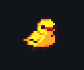
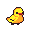
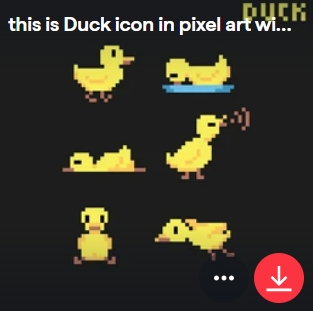
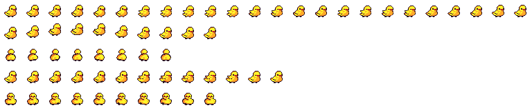
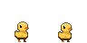
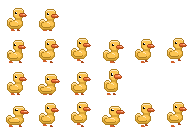

# 🦆 Duck4u

> Your AI-powered study companion that makes productivity actually enjoyable

**Status:** Week 1 Complete - Duck Window MVP ✅  
**Target:** Ship MVP in 4 weeks  
**Stack:** Electron + React + TypeScript + OpenAI + Supabase

---

## 🖼️ Screenshots & Demo

### Duck Character Design

*Main duck character design - pixel art style*

### Duck Animations

*Idle animation - the duck's default state*


*Jump animation - when the duck is excited*


*Running animation - side movement*


*Running animation - moving away*

### Development Progress

*Duck window running with developer tools - showing the transparent overlay functionality*

### Design Inspiration

*Design inspiration from Pinterest - cute pixel art style*

### Sprite Sheets

*Complete sprite sheet with all duck animations*


*Alternative duck idle sprite*


*Another spritesheet option with different art style*

---

## 📁 Project Documentation

- **[PRD.md](./docs/PRD.md)** - Complete Product Requirements Document (50+ pages)
- **[QUICK_START.md](./docs/QUICK_START.md)** - 4-week development sprint plan
- **[TECH_ALTERNATIVES.md](./docs/TECH_ALTERNATIVES.md)** - Technology options & trade-offs
- **[COST_CALCULATOR.md](./docs/COST_CALCULATOR.md)** - Economics & pricing analysis
- **[brainstorm.txt](./docs/brainstorm.txt)** - Original idea notes

---

## 🎯 What is Duck4u?

A desktop app featuring an animated rubber duck that:
- ✅ **Duck Window MVP** - Transparent, draggable duck companion
- 🔜 Transcribes lectures using AI (even in-person lectures!)
- 🔜 Takes smart notes with GPT-4
- 🔜 Acts as your study buddy (AI chat assistant)
- ✅ Makes studying less lonely (cute companion pet)
- 🔜 Helps you focus (productivity tracking)

**Target Users:** University students (Bachelor's/Master's)  
**Monetization:** $20/month subscription (freemium model)

### ✨ Current Implementation Status

**Week 1 Complete ✅**
- **Duck Window**: Frameless, transparent, always-on-top
- **Animations**: 4-state duck with idle, jump, run animations
- **Interactions**: Click & drag to move, double-click for control panel
- **Cross-platform**: Windows ready, Mac/Linux in Phase 2

**Next Up (Week 2)**
- Audio recording integration
- Whisper API transcription
- Control panel with React UI

---

## 🏗️ Tech Stack

| Layer | Technology | Why |
|-------|-----------|-----|
| **Framework** | Electron 28+ | Cross-platform desktop app |
| **Frontend** | React 18 + TypeScript | Modern, type-safe UI |
| **Animation** | Custom sprites/CSS | Developer-created animations |
| **Styling** | Tailwind CSS | Rapid development |
| **State** | Zustand | Lightweight state management |
| **Database** | SQLite (better-sqlite3) | Local-first storage |
| **Transcription** | OpenAI Whisper API | Speech-to-text |
| **AI Chat** | OpenAI GPT-4-turbo | Smart assistant |
| **Backend** | Supabase | Auth, user data, subscriptions |
| **Payments** | Stripe | Subscription billing |

---

## 🚀 Quick Start

### Prerequisites
- Node.js 18+
- npm or yarn
- Windows (Mac/Linux support in Phase 2)

### Development Setup (Current Implementation)

```bash
# Navigate to the electron app
cd duck4u-electron

# Install dependencies
npm install

# Run development mode (starts duck window)
npm run dev

# Build for production
npm run build
npm run package
```

### Initial Setup (For New Development)

```bash
# Clone/navigate to project
cd duck4u

# Initialize Electron + React project
npm create vite@latest duck4u-electron -- --template react-ts
cd duck4u-electron

# Install dependencies
npm install

# Add Electron
npm install -D electron electron-builder concurrently cross-env wait-on
npm install electron-is-dev

# Add core libraries
npm install zustand @supabase/supabase-js openai

# Add styling
npm install -D tailwindcss postcss autoprefixer
npx tailwindcss init -p

# Initialize git
git init
```

### Current Project Structure

```
duck4u-electron/
├── electron/                   # Main process ✅
│   ├── main.ts                 # Main process entry
│   ├── preload.ts              # IPC bridge
│   └── windows/
│       └── duckWindow.ts       # Duck overlay window
│
├── src/                        # Renderer process ✅
│   ├── duck-window/            # Duck UI & animations
│   │   ├── duck-main.ts        # Duck window logic
│   │   ├── duck.css            # Duck styling
│   │   └── DuckAnimationController.ts
│   ├── types/
│   │   └── electron.d.ts       # TypeScript definitions
│   └── main.ts                 # Vite entry point
│
├── public/                     # Static assets ✅
│   └── animations/             # Duck GIF files
│       ├── duck_idle.gif
│       ├── duck_jump.gif
│       ├── duck_run_aside.gif
│       └── duck_run_back.gif
│
├── docs/                       # Documentation ✅
│   ├── DEVELOPMENT.md
│   ├── IMPLEMENTATION.md
│   └── PROJECT_RECAP.md
│
├── duck.html                   # Duck window entry point ✅
├── package.json                # Dependencies & scripts ✅
├── electron-builder.json       # Build configuration ✅
└── README-PROGRESS.md          # Development progress
```

### Planned Structure (Future Development)

```
duck4u-electron/
├── electron/
│   ├── services/               # 🔜 Coming in Week 2
│   │   ├── audioCapture.ts
│   │   ├── whisperService.ts
│   │   └── screenCapture.ts
│   └── database/               # 🔜 Coming in Week 2
│       └── db.ts
│
├── src/
│   ├── windows/                # 🔜 Coming in Week 2
│   │   └── ControlPanel/
│   │       ├── ControlPanel.tsx
│   │       ├── ChatTab.tsx
│   │       ├── RecordTab.tsx
│   │       └── SettingsTab.tsx
│   ├── components/             # 🔜 Coming in Week 2
│   ├── hooks/                  # 🔜 Coming in Week 2
│   └── stores/                 # 🔜 Coming in Week 2
```

---

## 📋 MVP Feature Checklist

### Week 1: Foundation ✅ COMPLETE
- [x] Electron + React boilerplate running
- [x] Duck window (frameless, transparent, always-on-top)
- [x] Custom duck animation integrated (4 states: idle, jump, run aside, run back)
- [x] Window dragging works
- [x] Always-on-top behavior
- [ ] Control panel window appears on click (coming in Day 5-7)

### Week 2: Recording 🔜 IN PROGRESS
- [ ] Audio capture (Web Audio API)
- [ ] Recording indicator UI
- [ ] Save audio files
- [ ] Whisper API integration
- [ ] Transcription display
- [ ] Save transcripts to files + SQLite
- [ ] Control panel with React UI

### Week 3: AI Features 🔜 PLANNED
- [ ] Supabase project setup
- [ ] Auth (Clerk or Supabase)
- [ ] OpenAI GPT-4 chat integration
- [ ] "Enhance Transcript" feature
- [ ] Usage tracking & limits
- [ ] Free tier enforcement

### Week 4: Launch 🔜 PLANNED
- [ ] Stripe integration
- [ ] Subscription checkout flow
- [ ] Settings panel
- [ ] Onboarding tutorial
- [ ] Error handling & polish
- [ ] Build installer (Windows)
- [ ] Landing page
- [ ] Demo video
- [ ] Product Hunt launch

---

## 💰 Pricing Strategy

### Free Tier: "Study Buddy"
- 60 min transcription/month
- 3 AI enhancements/month
- 10 AI chat messages/day
- Basic duck companion

### Pro Tier: $20/month
- Unlimited transcription
- 20 hours AI enhancements/month
- 200 AI chat messages/day
- 10 screen vision queries/day
- Priority support

### Premium Tier: $35/month
- Everything unlimited
- 50 screen vision queries/day
- Early access to features
- Custom duck skins

---

## 📊 Success Metrics

**North Star:** Weekly Active Study Hours

**Goals (Month 12):**
- 10,000 total users
- 5% conversion to paid ($10K MRR)
- 15% Day 7 retention
- NPS > 40

---

## 🗓️ Roadmap

- **Phase 1 (Week 1-4):** MVP - Duck + Transcription + AI Chat
  - ✅ **Week 1 Complete**: Duck window with animations
  - 🔜 **Week 2**: Audio recording + Whisper transcription
  - 🔜 **Week 3**: AI chat integration + Supabase auth
  - 🔜 **Week 4**: Stripe billing + launch preparation
- **Phase 2 (Week 5-8):** Computer Vision (screen capture AI)
- **Phase 3 (Week 9-12):** Emotional features (pet interactions, skins)
- **Phase 4 (Month 4-6):** Study tools (flashcards, Pomodoro, exports)
- **Phase 5 (Month 6-9):** Mac/Linux support

---

## 🐛 Troubleshooting

### Duck doesn't appear
```bash
# Kill any running instances
taskkill /F /IM electron.exe
cd duck4u-electron
npm run dev
```

### Port 5173 in use
```bash
# Kill Vite process
Get-Process -Name node | Stop-Process -Force
cd duck4u-electron
npm run dev
```

### Development Issues
- See [duck4u-electron/docs/DEVELOPMENT.md](./duck4u-electron/docs/DEVELOPMENT.md) for detailed troubleshooting
- Check [duck4u-electron/README-PROGRESS.md](./duck4u-electron/README-PROGRESS.md) for current implementation status

---

## 🤝 Contributing

This is currently a solo project in pre-development.

If you're interested in collaborating, reach out!

---

## 📄 License

TBD (likely MIT or commercial)

---

## 🐛 Issues & Questions

Create an issue in this repo or reach out directly.

---

## 🙏 Acknowledgments

- Inspired by Desktop Goose (but for productivity!)
- Built with love for students struggling with note-taking

---

**Let's ship this duck! 🦆🚀**

